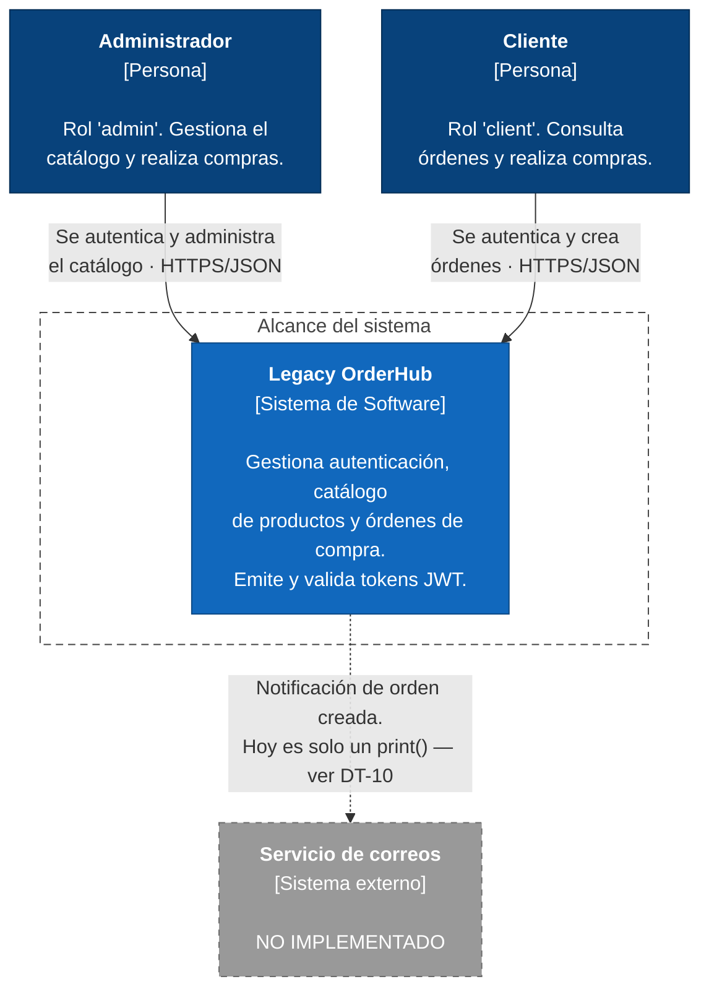
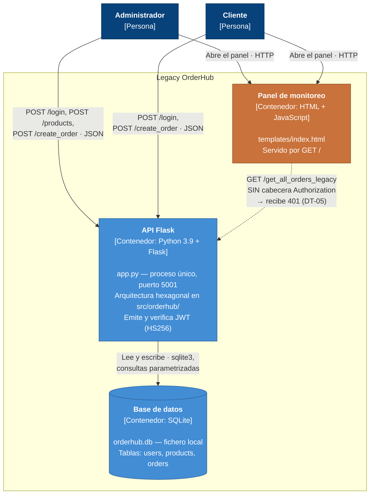
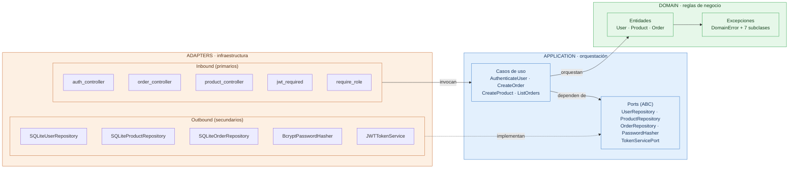

# Arquitectura de Legacy OrderHub (Estado Actual)

> **Estado del documento:** describe el código tal como existe hoy en la rama de
> trabajo actual, después de implementar Arquitectura Hexagonal (Ports &
> Adapters), autenticación con JWT (RF-01.3) y autorización por rol (RF-01.4).
> No describe un estado futuro ni funcionalidades planeadas.
>
> **Deuda técnica:** este documento describe cómo está construido el sistema.
> Lo que falta, lo que está diferido y lo que se resolvió se registra en
> **[`TECHNICAL_DEBT_LOG.md`](TECHNICAL_DEBT_LOG.md)**, que es la fuente única
> para ese tema. Aquí se enlaza en lugar de repetirlo, para que ambos
> documentos no se desincronicen.

---

## 1. Estado actual del proyecto

### 1.1 Qué era originalmente Legacy OrderHub

Legacy OrderHub nació como un monolito Flask de un solo archivo (`app.py`)
que mezclaba en los mismos handlers HTTP: enrutamiento, validación de
entrada, reglas de negocio (cálculo de totales, control de stock) y acceso
directo a SQLite mediante SQL crudo. `database.py` exponía una única función
`get_db_connection()` y `init_db()` para crear las tablas `users`,
`products` y `orders`, y sembrar datos de ejemplo.

Problemas concretos que tenía esa versión (visibles en `git show 4c79d1d`):

* **Inyección SQL en `/login`**: la consulta se construía concatenando
  directamente el `username` y el `password` recibidos en el request:
  `f"SELECT * FROM users WHERE username = '{username}' AND password = '{password}'"`.
* **Contraseñas en texto plano**: la tabla `users` solo tenía la columna
  `password` y se comparaba en texto plano.
* **Secretos hardcodeados**: `config.py` define `SECRET_KEY` y credenciales
  de una base de datos (`DB_HOST`, `DB_USER`, `DB_PASS`, `DB_NAME`)
  directamente en el código fuente.
* **Todo en `app.py`**: los tres endpoints (`/login`, `/create_order`,
  `/get_all_orders_legacy`) tenían el control HTTP, la lógica de negocio y el
  SQL en la misma función, sin ninguna capa intermedia.
* **Cero pruebas**: no existía ningún test.
* **Sin sesión ni autorización**: cualquiera podía invocar cualquier endpoint.

Los dos primeros puntos están resueltos y verificados con tests: ver
[DT-11](TECHNICAL_DEBT_LOG.md#dt-11--inyección-sql-en-login-resuelta) y
[DT-12](TECHNICAL_DEBT_LOG.md#dt-12--contraseñas-en-texto-plano-resuelta).

### 1.2 Qué existe hoy

Toda la lógica vive en `src/orderhub/`, siguiendo Arquitectura Hexagonal.
`app.py` no contiene lógica de negocio ni SQL: solo ensambla el `Container`
(composition root) y registra los blueprints HTTP.

* Paquete `src/orderhub/` con capas `domain`, `application` y `adapters`
  (sección 2).
* **Contraseñas con bcrypt** a través del puerto `PasswordHasher` y su
  adaptador `BcryptPasswordHasher` (RF-01.2).
* **Sesión mediante JWT firmado y con expiración**, a través del puerto
  `TokenServicePort` y su adaptador `JWTTokenService` (RF-01.3, sección 4).
* **Autorización por rol** mediante los decoradores `jwt_required` y
  `require_role`, aplicados sobre las vistas HTTP (RF-01.4, sección 5).
* **Cuatro endpoints de API** más el panel HTML: `/login`, `/create_order`,
  `/get_all_orders_legacy` y `/products` (sección 5.3).
* **Consultas parametrizadas** (`?`) en los tres repositorios SQLite; no queda
  concatenación de strings en SQL.
* **Configuración desde variables de entorno** en `src/orderhub/settings.py`
  para todo lo relativo a JWT.
* **125 tests** (unitarios y de integración) con **100 % de cobertura sobre
  `src/orderhub/`** (sección 9).

`database.py` se mantiene solo para el *bootstrap* del esquema y una migración
mínima; ya no se importa `get_db_connection` desde `app.py`.

### 1.3 Qué NO se ha implementado todavía

Esto es importante para no dar una imagen más avanzada de la que realmente
tiene el proyecto:

* **No hay interfaz gráfica de login.** El panel `templates/index.html` no
  tiene formulario de autenticación y, en consecuencia, su botón de consulta
  recibe hoy un `401` (decisión documentada en
  [DT-05](TECHNICAL_DEBT_LOG.md#dt-05--el-panel-html-no-envía-el-token)).
* **No hay refresh tokens ni revocación.** El token es de un solo uso hasta que
  expira; no existe *logout* del lado del servidor ni lista de revocación.
* **No hay registro de usuarios.** Los usuarios se siembran en `database.py`;
  no existe endpoint de alta ni caso de uso de creación de usuarios, y por
  tanto tampoco un flujo de hashing en alta (solo en el sembrado).
* **No hay gestión de productos más allá del alta y la consulta interna.** No
  existen endpoints de listado, edición ni borrado de productos; `RF-02.1`
  (consultar catálogo por API) sigue pendiente.
* **La columna `password` en texto plano todavía existe** en la tabla `users`
  ([DT-03](TECHNICAL_DEBT_LOG.md#dt-03--columna-password-en-texto-plano-en-el-esquema)).
* **`config.py` sigue teniendo secretos hardcodeados**
  ([DT-01](TECHNICAL_DEBT_LOG.md#dt-01--secretos-hardcodeados-en-configpy)).
* **No hay capa de notificaciones (`NotifierPort`).** El aviso de "orden
  creada" sigue siendo un `print()`
  ([DT-10](TECHNICAL_DEBT_LOG.md#dt-10--la-notificación-de-orden-sigue-siendo-un-print)).
* **No hay contenerización, CI, observabilidad ni PostgreSQL.** Es trabajo de
  las Unidades II a IV; ver la tabla final de
  [`TECHNICAL_DEBT_LOG.md`](TECHNICAL_DEBT_LOG.md#deuda-de-alcance-mayor-ya-registrada-en-el-backlog).

---

## 2. Arquitectura actual

El proyecto usa **Arquitectura Hexagonal (Ports & Adapters)**, viviendo en
`src/orderhub/`. Las tres capas están separadas por carpeta y por dirección de
dependencia: `domain` no depende de nada; `application` depende solo de
`domain`; `adapters` depende de `application` y `domain`, nunca al revés.

`app.py`, en la raíz, actúa como **composition root**: importa el paquete
`orderhub`, construye el `Container` y registra los blueprints Flask. Es el
único lugar donde el código de infraestructura (Flask) y el de la arquitectura
hexagonal se tocan.

### 2.1 Árbol de directorios real

```text
legacy-order-hub/
├── app.py                          # Composition root: Container + blueprints + jwt_required
├── config.py                       # Configuración legada (SECRET_KEY, etc.) — deuda DT-01
├── database.py                     # Bootstrap del esquema SQLite + migración de password_hash
├── requirements.txt                # Dependencias de ejecución (incluye PyJWT y bcrypt)
├── requirements-dev.txt            # pytest, pytest-cov, flake8, black
├── setup.cfg                       # Configuración de flake8 (max-line-length = 88)
├── pytest.ini                      # pythonpath = src ; testpaths = tests
├── templates/
│   └── index.html                  # Panel HTML de monitoreo servido por "/" — ver DT-05
├── docs/
│   ├── ANALYSIS_AND_REQUIREMENTS.md
│   ├── ARCHITECTURE.md             # Este documento
│   └── TECHNICAL_DEBT_LOG.md       # Registro de deuda técnica (HU-01.1)
├── src/
│   └── orderhub/
│       ├── settings.py             # Configuración JWT leída del entorno (os.environ)
│       ├── domain/
│       │   ├── entities/
│       │   │   ├── order.py        # Order (dataclass) + Order.create()
│       │   │   ├── product.py      # Product + Product.create() + reglas de stock/precio
│       │   │   └── user.py         # User (dataclass, incluye role)
│       │   └── exceptions.py       # DomainError y 7 subclases
│       ├── application/
│       │   ├── ports/
│       │   │   ├── order_repository.py
│       │   │   ├── product_repository.py
│       │   │   ├── user_repository.py
│       │   │   ├── password_hasher.py
│       │   │   └── token_service.py         # TokenServicePort + TokenPayload + errores
│       │   └── use_cases/
│       │       ├── authenticate_user.py
│       │       ├── create_order.py
│       │       ├── create_product.py        # RF-01.4
│       │       └── list_orders.py
│       ├── adapters/
│       │   ├── inbound/http/
│       │   │   ├── auth_controller.py       # POST /login (emite el token)
│       │   │   ├── order_controller.py      # POST /create_order, GET /get_all_orders_legacy
│       │   │   ├── product_controller.py    # POST /products (solo admin)
│       │   │   ├── jwt_required.py          # Decorador de autenticación
│       │   │   └── require_role.py          # Decorador de autorización
│       │   └── outbound/
│       │       ├── persistence/sqlite/
│       │       │   ├── connection.py               # SQLiteConnectionFactory
│       │       │   ├── sqlite_order_repository.py
│       │       │   ├── sqlite_product_repository.py
│       │       │   └── sqlite_user_repository.py
│       │       └── security/
│       │           ├── bcrypt_password_hasher.py   # Adaptador de PasswordHasher
│       │           └── jwt_token_service.py        # Adaptador de TokenServicePort
│       └── container.py            # Composition root de orderhub: instancia todo y lo inyecta
└── tests/
    ├── conftest.py                 # Fixtures comunes (identidades, helper Bearer)
    ├── unit/
    │   ├── domain/                 # 10 tests
    │   ├── application/            # 19 tests
    │   └── adapters/               # 47 tests
    └── integration/                # 49 tests (Flask + SQLite reales)
```

### 2.2 Diagrama C4 — Nivel 1: Contexto

Quién usa el sistema y con qué se relaciona. Refleja únicamente lo que existe
en el código.



> **Honestidad del diagrama:** el «servicio de correos» se dibuja punteado y
> marcado como no implementado porque en el código es literalmente una llamada
> a `print()` en `order_controller.py`. No existe integración con ningún
> sistema externo real. Tampoco hay pasarela de pagos, servicio de identidad
> externo ni cola de mensajes.

### 2.3 Diagrama C4 — Nivel 2: Contenedores

Cómo se descompone el sistema en unidades ejecutables o de almacenamiento.



> **Lo que este diagrama NO muestra porque no existe:** no hay PostgreSQL, ni
> Redis, ni contenedores Docker, ni balanceador, ni servidor WSGI de
> producción. La aplicación corre con el servidor de desarrollo de Flask
> (`app.run(host="0.0.0.0", port=5001, debug=True)`, `app.py:65`) y la
> persistencia es un fichero SQLite en el disco local.

### 2.4 Capas y dirección de dependencias

Este diagrama no es parte del modelo C4: muestra la regla estructural interna
de la arquitectura hexagonal, es decir, **hacia dónde puede apuntar un
`import`**. Todas las flechas van hacia adentro; ninguna sale del núcleo.



**Cómo se verifica esta regla en el código, sin confiar en el diagrama:**

| Afirmación | Cómo comprobarla |
| :--- | :--- |
| `domain` no depende de nada externo | Los imports de `domain/entities/*.py` y `domain/exceptions.py` solo referencian `dataclasses`, `typing` y otros módulos del propio dominio. |
| `application` no conoce infraestructura | Ningún módulo de `application/` importa `flask`, `sqlite3`, `bcrypt` ni `jwt`. |
| `adapters` implementa, no define | Cada adaptador *outbound* hereda del `ABC` correspondiente en `application/ports/`. |
| La inversión es real | `AuthenticateUser` recibe `UserRepository` y `PasswordHasher` por constructor y nunca instancia una clase concreta. |

La consecuencia práctica es que los casos de uso se prueban con dobles en
memoria, sin levantar Flask ni SQLite (`tests/unit/application/`).

---

## 3. Explicación de cada capa

### 3.1 Domain (`src/orderhub/domain/`)

Contiene las **entidades** (`Order`, `Product`, `User`) y las **excepciones de
dominio** (`domain/exceptions.py`). Son `dataclasses` simples con la mínima
lógica de negocio que les pertenece directamente:

* `Product.create()` valida las invariantes de un producto nuevo: nombre no
  vacío, precio mayor que cero y stock no negativo. Las reglas viven en la
  entidad y no en el controller, porque un producto inválido lo es venga de
  HTTP, de un script o de una importación masiva.
* `Product.has_stock_for()`, `Product.decrease_stock()` y `Product.price_for()`
  concentran las reglas de stock y precio.
* `Order.create()` calcula el total a partir del producto y valida que la
  cantidad sea mayor que cero.
* `User` es un contenedor de datos con `id`, `username`, `password_hash` y
  `role`; **no** valida contraseñas (ver 3.4) ni decide permisos (ver 5.2).

Las excepciones son siete, todas heredando de `DomainError`:
`ProductNotFoundError`, `InsufficientStockError`, `InvalidQuantityError`,
`InvalidCredentialsError`, `InvalidProductNameError`, `InvalidProductPriceError`
e `InvalidStockError`.

**Qué NO conoce el dominio:** HTTP, Flask, SQL, sqlite3, bcrypt, JWT, ni ningún
detalle de infraestructura.

### 3.2 Application (`src/orderhub/application/`)

#### Casos de uso (`application/use_cases/`)

Un caso de uso orquesta entidades de dominio y puertos para cumplir una acción
concreta. No conocen Flask ni SQL — dependen únicamente de las interfaces
(`ABC`) definidas en `application/ports/`. Los cuatro que existen hoy:

* **`AuthenticateUser`**: busca el usuario por username vía `UserRepository`, y
  si existe, verifica la contraseña vía `PasswordHasher`. Lanza
  `InvalidCredentialsError` si el usuario no existe o la contraseña no coincide
  (mismo error en ambos casos, para no filtrar si el username existe).
  **No emite el token**: ver sección 4.2.
* **`CreateOrder`**: busca el producto, valida stock, crea la `Order` (el total
  lo calcula la entidad), la persiste, descuenta el stock y lo persiste.
* **`CreateProduct`**: delega la validación en `Product.create()` y persiste vía
  `ProductRepository.save()`. **No decide quién puede invocarlo**: esa es una
  decisión del adaptador HTTP, que es donde vive el concepto de "usuario
  autenticado".
* **`ListOrders`**: delega directamente en `OrderRepository.find_all()`.

#### Ports (`application/ports/`)

Un **port** es una interfaz (`ABC` con métodos `@abstractmethod`) que la capa de
aplicación define porque *necesita* algo del exterior, sin saber *cómo* se
implementa. Existen para que los casos de uso dependan de una abstracción y no
de una tecnología concreta, lo cual permite testearlos con dobles en memoria y
sustituir infraestructura sin tocar `application/` ni `domain/`.

En este proyecto **todos los ports son de salida (output ports)**:

| Port | Métodos | Implementación concreta |
| :--- | :--- | :--- |
| `UserRepository` | `find_by_username()` | `SQLiteUserRepository` |
| `ProductRepository` | `find_by_id()`, `update_stock()`, `save()` | `SQLiteProductRepository` |
| `OrderRepository` | `save()`, `find_all()` | `SQLiteOrderRepository` |
| `PasswordHasher` | `verify()` | `BcryptPasswordHasher` |
| `TokenServicePort` | `generate()`, `verify()` | `JWTTokenService` |

`token_service.py` además define el tipo `TokenPayload` (dataclass congelada con
`user_id`, `username` y `role`) y las excepciones `TokenError`,
`InvalidTokenError` y `ExpiredTokenError`. **Estas excepciones se declaran en el
puerto y no en el adaptador** a propósito: así quien consume el puerto puede
capturar el fallo sin importar la librería concreta que lo produjo. Es lo que
permite que `jwt_required` no importe PyJWT.

No existen **input ports** explícitos: los adaptadores HTTP llaman directamente
a las clases de caso de uso como si el propio caso de uso fuera el puerto de
entrada. Es una simplificación común y razonable en proyectos de este tamaño,
pero vale aclararlo para no decir que existe algo que no existe.

### 3.3 Adapters (`src/orderhub/adapters/`)

Un **adapter** es la implementación concreta de un port (outbound) o el punto de
entrada concreto que traduce un protocolo externo a una llamada a un caso de uso
(inbound).

#### Inbound adapters (`adapters/inbound/http/`)

* **`auth_controller.py`**: expone `POST /login`. Extrae `username`/`password`
  del JSON, llama a `AuthenticateUser.execute()`, emite el token con
  `TokenServicePort.generate()` y traduce `InvalidCredentialsError` a un `401`.
  Nunca serializa el password ni el hash en la respuesta.
* **`order_controller.py`**: expone `POST /create_order` y
  `GET /get_all_orders_legacy`, ambos bajo `@jwt_required`. Traduce las
  excepciones de dominio (`ProductNotFoundError` → 404,
  `InsufficientStockError` / `InvalidQuantityError` → 400) a códigos HTTP. Las
  rutas conservan exactamente los mismos nombres que en la versión legada.
* **`product_controller.py`**: expone `POST /products` bajo `@jwt_required` +
  `@require_role("admin")`. Valida solo la *forma* del JSON (que `price` sea
  numérico y `stock` entero); las reglas de negocio quedan en `Product.create()`.
* **`jwt_required.py`** y **`require_role.py`**: decoradores de autenticación y
  autorización. Se detallan en la sección 5.

#### Outbound adapters (`adapters/outbound/`)

* **Persistencia SQLite** (`adapters/outbound/persistence/sqlite/`):
  * `connection.py` → `SQLiteConnectionFactory`: clase invocable que crea
    conexiones `sqlite3` con `row_factory = sqlite3.Row`. Se inyecta en los
    repositorios.
  * `sqlite_user_repository.py` → `SQLiteUserRepository`: implementa
    `UserRepository`. Solo hace `SELECT id, username, password_hash, role` —
    nunca lee la columna `password` en texto plano.
  * `sqlite_product_repository.py` → `SQLiteProductRepository`: implementa
    `ProductRepository`, incluido `save()` para el alta de catálogo.
  * `sqlite_order_repository.py` → `SQLiteOrderRepository`: implementa
    `OrderRepository`.
  * Las tres usan siempre consultas parametrizadas (`?`), nunca concatenación.
* **Seguridad** (`adapters/outbound/security/`):
  * `bcrypt_password_hasher.py` → `BcryptPasswordHasher` implementa
    `PasswordHasher` usando `bcrypt.checkpw`.
  * `jwt_token_service.py` → `JWTTokenService` implementa `TokenServicePort`
    usando PyJWT. Es el **único módulo del proyecto que importa `jwt`**.

### 3.4 Dependency Injection y Repository Pattern

`src/orderhub/container.py` es el **composition root** de la arquitectura
hexagonal: es el único módulo que instancia clases concretas (los tres
repositorios SQLite, el hasher bcrypt, el servicio de tokens) y las inyecta por
constructor en los casos de uso. Nada dentro de `application/` o `domain/`
instancia una clase concreta de infraestructura.

`app.py`, a su vez, instancia `Container(database_path=DB_PATH)` una sola vez al
arrancar, construye el decorador `jwt_required` a partir de
`container.token_service` y pasa los casos de uso ya construidos a los
blueprints. Esto es Dependency Injection manual (sin framework de DI).

> **Por qué `jwt_required` se construye en `app.py` y no en el `Container`:** el
> decorador es código Flask, y el `Container` no conoce Flask. Mantener esa
> frontera es lo que permite que `Container` se pruebe sin levantar una app web
> (`tests/integration/test_container.py`).

El **Repository Pattern** se aplica en los tres repositorios SQLite: cada uno
oculta el detalle de que la persistencia es SQLite y expone una interfaz en
términos del dominio (`find_by_id`, `save`, `find_all`, etc.).

### 3.5 Configuración (`src/orderhub/settings.py`)

Módulo que lee del entorno toda la configuración de infraestructura relativa a
JWT, con valores por defecto para que el proyecto arranque sin configuración
previa:

| Variable de entorno | Valor por defecto | Uso |
| :--- | :--- | :--- |
| `JWT_SECRET_KEY` | `dev-only-insecure-jwt-secret-change-me` | Clave de firma HS256 |
| `JWT_ALGORITHM` | `HS256` | Algoritmo de firma |
| `JWT_EXPIRATION_MINUTES` | `60` | Tiempo de vida del token |

Vive junto al composition root porque es él quien decide con qué valores se
construyen los adaptadores; ni el dominio ni la capa de aplicación lo importan.

> Es el patrón que `config.py` debería seguir y no sigue
> ([DT-01](TECHNICAL_DEBT_LOG.md#dt-01--secretos-hardcodeados-en-configpy)). El
> valor por defecto de `JWT_SECRET_KEY` es a su vez deuda propia
> ([DT-02](TECHNICAL_DEBT_LOG.md#dt-02--valor-por-defecto-inseguro-de-jwt_secret_key)):
> es cómodo en desarrollo y peligroso si se despliega sin configurar.

---

## 4. Autenticación (RF-01.2, RF-01.3)

### 4.1 Dónde está cada pieza

| Pieza | Ubicación |
| :--- | :--- |
| Caso de uso | `application/use_cases/authenticate_user.py` (`AuthenticateUser`) |
| Entidad `User` | `domain/entities/user.py` |
| Puerto del repositorio de usuarios | `application/ports/user_repository.py` |
| Repositorio SQLite de usuarios | `adapters/outbound/persistence/sqlite/sqlite_user_repository.py` |
| Puerto de hashing | `application/ports/password_hasher.py` |
| Adaptador BCrypt | `adapters/outbound/security/bcrypt_password_hasher.py` |
| Puerto de tokens | `application/ports/token_service.py` (`TokenServicePort`) |
| Adaptador JWT | `adapters/outbound/security/jwt_token_service.py` (`JWTTokenService`) |
| Decorador de autenticación | `adapters/inbound/http/jwt_required.py` |
| Controlador HTTP | `adapters/inbound/http/auth_controller.py` |
| Configuración | `settings.py` |
| Ensamblado (DI) | `container.py` + `app.py` |

### 4.2 Por qué el token se emite en el controlador y no en el caso de uso

`AuthenticateUser.execute()` devuelve un `User` y **no** un token. La emisión
ocurre en `auth_controller.py`, que llama a `token_service.generate(user)`.

La razón es una frontera de responsabilidad: **autenticar es una regla de
negocio** («estas credenciales corresponden a este usuario»), mientras que **el
formato en que se transporta la sesión es un detalle del protocolo HTTP**. Si el
caso de uso devolviera un JWT, la capa de aplicación quedaría atada a una
decisión de transporte, y un consumidor no-HTTP (una CLI, un script) recibiría
un token que no necesita.

### 4.3 El token JWT: qué contiene y cómo se firma

`JWTTokenService.generate()` construye un payload con cinco claims:

| Claim | Origen | Propósito |
| :--- | :--- | :--- |
| `user_id` | `user.id` | Identidad; se usa como dueño de las órdenes |
| `username` | `user.username` | Identidad legible |
| `role` | `user.role` | Autorización (RF-01.4) |
| `iat` | Reloj inyectado | Momento de emisión |
| `exp` | `iat + expiration_minutes` | **Expiración (exigida por RF-01.3)** |

Se firma con `HS256` y la clave de `settings.JWT_SECRET_KEY`.

En la verificación, `jwt.decode` se invoca con
`options={"require": ["exp", "user_id", "username", "role"]}`: un token al que
le falte cualquiera de esos claims se rechaza, incluso si la firma es válida.
Esto impide aceptar un token técnicamente bien firmado pero sin expiración.

El adaptador traduce las excepciones de PyJWT a las del puerto —
`jwt.ExpiredSignatureError` → `ExpiredTokenError`, cualquier otra
`jwt.PyJWTError` → `InvalidTokenError` — de modo que ninguna capa superior
importa PyJWT.

> **Detalle de diseño para poder probar la expiración:** el constructor de
> `JWTTokenService` acepta un `clock` inyectable (por defecto, la hora UTC
> actual). Los tests emiten tokens "desde el pasado" pasando un reloj falso, en
> lugar de esperar con `sleep()` a que un token caduque de verdad.

### 4.4 Flujo real de una petición a `/login`

```text
HTTP POST /login {username, password}
        ↓
auth_controller.login_endpoint()               (Inbound Adapter)
        ↓
AuthenticateUser.execute(username, password)   (Use Case)
        ↓
UserRepository.find_by_username(username)      (Output Port)
        ↓
SQLiteUserRepository                           (Outbound Adapter)
        ↓
SQLite: SELECT id, username, password_hash, role FROM users WHERE username = ?
        ↓
(de vuelta en el Use Case)
        ↓
PasswordHasher.verify(password, user.password_hash)     (Output Port)
        ↓
BcryptPasswordHasher.verify()  →  bcrypt.checkpw(...)   (Outbound Adapter)
        ↓
Use Case devuelve User  o  lanza InvalidCredentialsError
        ↓
(de vuelta en el Inbound Adapter)
        ↓
TokenServicePort.generate(user)  →  JWTTokenService  →  jwt.encode(...)
        ↓
auth_controller traduce a JSON 200 {status, token, user{id, username, role}}
                        o JSON 401 {status: error, message}
```

### 4.5 Cómo se verifica una contraseña

`AuthenticateUser.execute()` primero busca al usuario por `username`. Si no
existe, lanza `InvalidCredentialsError` de inmediato. Si existe, delega en
`PasswordHasher.verify(password, user.password_hash)`, que en producción es
`BcryptPasswordHasher`, y este llama a `bcrypt.checkpw()`. Si la contraseña no
coincide, se lanza **el mismo error** que cuando el usuario no existe, para no
revelar por el mensaje si un username es válido.

### 4.6 Cómo se almacena el password

Al arrancar, `database.py::init_db()` siembra dos usuarios de ejemplo
(`admin`/`admin123` con rol `admin`, y `juan`/`123456` con rol `client`) y
calcula su `password_hash` con `bcrypt.hashpw(...)` antes de insertarlos.

La tabla `users` tiene columnas `password` (texto plano, legado) y
`password_hash` (bcrypt). `SQLiteUserRepository` **solo lee `password_hash`**.
Esa columna legada sigue existiendo pero está desconectada del flujo real de
autenticación:
[DT-03](TECHNICAL_DEBT_LOG.md#dt-03--columna-password-en-texto-plano-en-el-esquema).

### 4.7 Por qué un hash y no texto plano

Guardar la contraseña en texto plano significa que cualquiera con acceso de
lectura a la base de datos (un backup filtrado, un admin malicioso, una
inyección SQL como la que tenía el `/login` original) obtiene la contraseña real
de cada usuario, la cual muchas personas reutilizan en otros sistemas. Un hash
de bcrypt es de un solo sentido y usa *salt* automático, así que ni siquiera dos
usuarios con la misma contraseña producen el mismo hash. Verificar consiste en
volver a aplicar el algoritmo con el mismo salt y comparar, nunca en
"desencriptar".

---

## 5. Autorización (RF-01.4)

### 5.1 Dos decoradores, dos responsabilidades

La autenticación («¿quién eres?») y la autorización («¿puedes hacer esto?») se
implementan por separado y se componen apilándolas:

```python
@blueprint.route("/products", methods=["POST"])
@jwt_required
@require_role(ADMIN_ROLE)
def create_product_endpoint():
    ...
```

**`jwt_required`** (`jwt_required.py`) se construye mediante una fábrica,
`create_jwt_required(token_service)`, porque necesita el `TokenServicePort`
inyectado. Se usa la misma forma *factory* que `create_*_blueprint` para no
depender de un singleton global y poder inyectar un doble en los tests. El
decorador:

1. Lee la cabecera `Authorization`.
2. Exige el prefijo `Bearer ` y un token no vacío.
3. Delega la verificación en `token_service.verify(token)`.
4. Deja la identidad (`TokenPayload`) en `flask.g.current_user`.

Cualquier fallo devuelve **401** con un mensaje que distingue el motivo: falta
de cabecera, formato inválido, token ausente, `Token expirado` o
`Token inválido`. **No importa PyJWT**: solo conoce el puerto y sus excepciones.

**`require_role(*roles)`** (`require_role.py`) se apoya en la identidad que
`jwt_required` ya dejó en `g.current_user`; no vuelve a leer ni decodificar el
token. No necesita dependencias inyectadas, así que la fábrica es el propio
`require_role(...)`.

### 5.2 Decisiones de diseño explícitas en la autorización

| Decisión | Motivo |
| :--- | :--- |
| Devuelve **403**, no 401, cuando el rol no basta | `401` significa «no sé quién eres»; `403` significa «sé quién eres y aun así no puedes». Son situaciones distintas y el cliente debe poder distinguirlas. |
| Si no hay identidad en `g`, lanza `RuntimeError` | Es un **error de programación**, no del cliente: significa que se decoró una vista con `require_role` sin poner `@jwt_required` encima. Se falla ruidosamente en vez de devolver un 401/403 que escondería el cableado mal hecho. |
| `require_role()` sin argumentos lanza `ValueError` | Un decorador que no restringe nada es casi con seguridad un error de escritura. |
| El rol vive en el token, no se reconsulta en la BD | Evita un `SELECT` por petición. Contrapartida asumida: un cambio de rol no surte efecto hasta que el token expira. |
| La decisión de permisos vive en el adaptador, no en el caso de uso | `CreateProduct` no sabe de usuarios ni de roles. El concepto de «usuario autenticado» pertenece a la capa HTTP. |

### 5.3 Mapa de endpoints y su protección

Verificado leyendo cada decorador en los controladores:

| Método | Ruta | Autenticación | Rol exigido | Definido en |
| :--- | :--- | :--- | :--- | :--- |
| `GET` | `/` | ❌ **Público** | — | `app.py:53-55` |
| `POST` | `/login` | ❌ **Público** | — | `auth_controller.py:23` |
| `POST` | `/create_order` | ✅ `@jwt_required` | Cualquiera autenticado | `order_controller.py:31-32` |
| `GET` | `/get_all_orders_legacy` | ✅ `@jwt_required` | Cualquiera autenticado | `order_controller.py:69-70` |
| `POST` | `/products` | ✅ `@jwt_required` | **`admin`** | `product_controller.py:28-30` |

**Por qué `/create_order` no exige rol `admin`:** crear una orden *es comprar*.
Restringirlo a administradores impediría el caso de uso central del sistema. La
restricción administrativa de RF-01.4 aplica a la gestión del **catálogo**
(`POST /products`), no a la compra.

**Por qué `GET /` es público:** es el panel HTML de monitoreo, no una operación
sobre datos. Sirve la plantilla y nada más; los datos que intenta pintar sí
están protegidos — de hecho, esa llamada AJAX recibe hoy un 401
([DT-05](TECHNICAL_DEBT_LOG.md#dt-05--el-panel-html-no-envía-el-token)).

### 5.4 El `user_id` se toma del token, nunca del cuerpo

En `POST /create_order`, el dueño de la orden se lee de
`g.current_user.user_id`, **no** de `data.get("user_id")`:

```python
order = create_order.execute(
    user_id=g.current_user.user_id,   # ← identidad del token
    product_id=data.get("product_id"),
    quantity=int(data.get("quantity", 1)),
)
```

El cuerpo de la petición lo controla el cliente: aceptar de ahí el `user_id`
permitiría crear órdenes a nombre de cualquier otro usuario. Esto se verifica
activamente en
[`test_full_flow_http.py:83-94`](../tests/integration/test_full_flow_http.py):
el test envía `user_id: 9999` en el cuerpo y comprueba que la orden se registra
igualmente a nombre del dueño del token.

### 5.5 Diagrama de secuencia: login → token → petición protegida

Flujo completo de un administrador que se autentica y crea un producto.
Corresponde al caso probado en
`test_flujo_admin_login_crear_producto_comprar_y_listar`.

```mermaid
sequenceDiagram
    autonumber
    actor Admin
    participant AC as auth_controller<br/>(inbound)
    participant AU as AuthenticateUser<br/>(use case)
    participant UR as SQLiteUserRepository<br/>(outbound)
    participant PH as BcryptPasswordHasher<br/>(outbound)
    participant TS as JWTTokenService<br/>(outbound)
    participant JR as jwt_required +<br/>require_role
    participant PC as product_controller<br/>(inbound)
    participant CP as CreateProduct<br/>(use case)
    participant PR as SQLiteProductRepository<br/>(outbound)
    participant DB as SQLite

    rect rgb(232, 244, 253)
    note over Admin,DB: FASE 1 — Autenticación (POST /login, público)
    Admin->>AC: POST /login {username, password}
    AC->>AU: execute(username, password)
    AU->>UR: find_by_username(username)
    UR->>DB: SELECT id, username, password_hash, role<br/>FROM users WHERE username = ?
    DB-->>UR: fila
    UR-->>AU: User(id, username, password_hash, role)
    AU->>PH: verify(password, user.password_hash)
    PH-->>AU: True
    AU-->>AC: User
    AC->>TS: generate(user)
    TS-->>AC: JWT firmado HS256<br/>{user_id, username, role, iat, exp}
    AC-->>Admin: 200 {status, token, user}
    end

    rect rgb(253, 240, 227)
    note over Admin,DB: FASE 2 — Petición protegida (POST /products, solo admin)
    Admin->>JR: POST /products {name, price, stock}<br/>Authorization: Bearer &lt;token&gt;
    JR->>JR: Lee cabecera, valida prefijo "Bearer "
    JR->>TS: verify(token)
    TS-->>JR: TokenPayload(user_id, username, role)
    JR->>JR: g.current_user = payload
    JR->>JR: require_role: ¿role == "admin"?
    JR->>PC: sí → invoca la vista
    PC->>CP: execute(name, price, stock)
    CP->>CP: Product.create() valida invariantes
    CP->>PR: save(product)
    PR->>DB: INSERT INTO products (name, price, stock)<br/>VALUES (?, ?, ?)
    DB-->>PR: lastrowid
    PR-->>CP: Product con id asignado
    CP-->>PC: Product
    PC-->>Admin: 201 {status, product}
    end
```

**Caminos de error del mismo flujo**, todos cubiertos por tests:

| Situación | Dónde se corta | Respuesta |
| :--- | :--- | :--- |
| Credenciales inválidas | `AuthenticateUser` | `401 Credenciales inválidas` |
| Sin cabecera `Authorization` | `jwt_required` | `401 Falta la cabecera Authorization` |
| Cabecera sin prefijo `Bearer ` | `jwt_required` | `401 Formato de cabecera inválido...` |
| Token expirado | `TokenServicePort` → `jwt_required` | `401 Token expirado` |
| Firma inválida o token manipulado | `TokenServicePort` → `jwt_required` | `401 Token inválido` |
| Rol `client` en `/products` | `require_role` | `403 No tienes permisos...` |
| Datos de producto inválidos | `Product.create()` | `400` con el mensaje del dominio |

---

## 6. Estado de funcionalidades

| Funcionalidad | Estado | Observaciones |
| :--- | :--- | :--- |
| Validación de usuario (búsqueda por username) | ✅ Implementada | `SQLiteUserRepository.find_by_username` |
| Verificación de password con bcrypt (RF-01.2) | ✅ Implementada | Puerto `PasswordHasher` / `BcryptPasswordHasher` |
| Endpoint de login (`POST /login`) | ✅ Implementado | Emite JWT; SQL parametrizado |
| **JWT con expiración (RF-01.3)** | ✅ **Implementado** | `TokenServicePort` / `JWTTokenService`, claim `exp` obligatorio |
| **Autorización por rol (RF-01.4)** | ✅ **Implementado** | `jwt_required` + `require_role("admin")` sobre `POST /products` |
| **Endpoint de creación de productos** | ✅ **Implementado** | `POST /products`, restringido a `admin` |
| Endpoint de creación de orden (`POST /create_order`) | ✅ Implementado | Protegido; `user_id` tomado del token |
| Endpoint de listado de órdenes (`GET /get_all_orders_legacy`) | ✅ Implementado | Protegido; nombre de ruta conservado del legado |
| Configuración JWT por variables de entorno | ✅ Implementada | `settings.py` (`os.environ`) |
| **Tests unitarios** | ✅ Implementados | 76 tests: dominio (10), aplicación (19), adaptadores (47) |
| **Tests de integración HTTP** | ✅ **Implementados** | 49 tests con Flask `test_client()` y SQLite real |
| **Cobertura ≥ 80 % (RNF-01.2)** | ✅ **Cumplida** | 100 % en `src/orderhub/`; 86 % del código fuente total |
| **PEP 8 en `src/orderhub/` y `tests/` (RNF-01.3)** | ✅ **Cumplida** | `flake8` y `black --check` sin ningún hallazgo |
| PEP 8 en los archivos de la raíz | ⚠️ Parcial | `E501` resueltos; quedan 5 `E402` estructurales en `app.py` ([DT-08](TECHNICAL_DEBT_LOG.md#dt-08--los-archivos-de-la-raíz-no-pasan-flake8-parcialmente-resuelta)) |
| Unicidad de `users.username` | ✅ Implementada | `UNIQUE` en el esquema + índice único para bases existentes ([DT-09](TECHNICAL_DEBT_LOG.md#dt-09--el-esquema-no-tiene-restricciones-de-integridad-parcialmente-resuelta)) |
| Claves foráneas y `NOT NULL` en el esquema | ❌ No implementadas | Requiere recrear tablas ([DT-09](TECHNICAL_DEBT_LOG.md#dt-09--el-esquema-no-tiene-restricciones-de-integridad-parcialmente-resuelta)) |
| Interfaz gráfica de login | ❌ No implementada | El panel no envía token ([DT-05](TECHNICAL_DEBT_LOG.md#dt-05--el-panel-html-no-envía-el-token)) |
| Registro de usuarios por API | ❌ No implementado | Los usuarios se siembran en `database.py` |
| Consulta del catálogo por API (RF-02.1) | ❌ No implementado | Existe `find_by_id` interno, no un endpoint `GET /products` |
| Refresh token / revocación / logout | ❌ No implementado | El token vive hasta expirar |
| Eliminación de la columna `password` | ❌ No implementada | [DT-03](TECHNICAL_DEBT_LOG.md#dt-03--columna-password-en-texto-plano-en-el-esquema) |
| Migración de `config.py` a `.env` | ❌ No implementada | [DT-01](TECHNICAL_DEBT_LOG.md#dt-01--secretos-hardcodeados-en-configpy) |
| Notificación vía `NotifierPort` (RF-04.1) | ❌ No implementada | Sigue siendo un `print()` ([DT-10](TECHNICAL_DEBT_LOG.md#dt-10--la-notificación-de-orden-sigue-siendo-un-print)) |
| Contenerización, CI, K8s, observabilidad | ❌ No implementadas | Unidades II–IV; ver [backlog de deuda](TECHNICAL_DEBT_LOG.md#deuda-de-alcance-mayor-ya-registrada-en-el-backlog) |

---

## 7. Cambios respecto a la arquitectura legacy

```text
ANTES (app.py monolítico)

HTTP Request  (sin autenticación de ningún tipo)
     ↓
app.py (handler)
     ├── parseo de la petición
     ├── SQL armado por concatenación de strings   ← inyección SQL
     ├── comparación de password en texto plano    ← fuga de credenciales
     ├── reglas de negocio (cálculo de total, chequeo de stock)
     └── acceso directo a SQLite (get_db_connection)


AHORA (Hexagonal / Ports & Adapters)

HTTP Request
     ↓
@jwt_required  →  TokenServicePort  →  JWTTokenService   (identidad)
     ↓
@require_role  →  lee g.current_user.role                (permisos)
     ↓
Inbound Adapter (auth / order / product controller)
     ↓
Use Case (AuthenticateUser / CreateOrder / CreateProduct / ListOrders)
     ↓
Output Port (UserRepository / ProductRepository / OrderRepository
             / PasswordHasher / TokenServicePort)
     ↓
Outbound Adapter (SQLite* / BcryptPasswordHasher / JWTTokenService)
     ↓
SQLite (orderhub.db) · bcrypt · PyJWT
```

Esta separación mejora, de forma concreta y verificable en este código:

* **Seguridad**: la identidad se valida antes de llegar al controlador, el SQL
  es parametrizado y las contraseñas nunca se comparan en claro. Los tres
  puntos tienen tests que fallarían si se revirtieran.
* **Mantenibilidad**: cambiar cómo se calcula un total (`Order.create` /
  `Product.price_for`) no requiere tocar SQL, Flask ni JWT.
* **Testabilidad**: los casos de uso se prueban con repositorios en memoria, sin
  levantar Flask ni sqlite3. La cobertura de `src/orderhub/` es del 100 %.
* **Separación de responsabilidades**: cada capa tiene un tipo de cambio que le
  corresponde (SQL vs. reglas de negocio vs. protocolo HTTP vs. sesión).
* **Sustitución de infraestructura**: cambiar de SQLite a otro motor, o de PyJWT
  a otra librería de tokens, implica reescribir un adaptador sin tocar `domain/`
  ni `application/`. El caso del token es el ejemplo más claro: `JWTTokenService`
  es el único módulo que importa `jwt`.
* **Evolución futura**: agregar un `NotifierPort` es agregar un port y un
  adaptador nuevos, sin modificar los casos de uso existentes más que para
  inyectar la nueva dependencia.

---

## 8. Estrategia de pruebas

### 8.1 Cómo está organizada la suite

| Directorio | Tests | Qué prueba | Con qué infraestructura |
| :--- | ---: | :--- | :--- |
| `tests/unit/domain/` | 10 | Invariantes de `Product` y `Order` | Ninguna |
| `tests/unit/application/` | 19 | Casos de uso | Dobles en memoria |
| `tests/unit/adapters/` | 47 | Controladores, decoradores, bcrypt, JWT | Flask de juguete + dobles |
| `tests/integration/` | 49 | Repositorios, `Container` y flujos HTTP completos | Flask + SQLite reales |
| **Total** | **125** | | |

### 8.2 Aislamiento de la suite de integración

Cada test de integración recibe **un fichero SQLite propio** bajo `tmp_path`,
creado y sembrado desde cero; nunca se abre `orderhub.db`.

> **Por qué un fichero temporal y no `:memory:`**: `SQLiteConnectionFactory`
> abre una conexión nueva en cada llamada y la cierra al terminar. Con
> `":memory:"` cada conexión sería una base distinta y vacía, así que los
> repositorios no verían nada de lo que escribieron. Un fichero por test da el
> mismo aislamiento y sí sobrevive entre conexiones.

La fixture siembra en la columna legada `password` un valor **distinto** del
hash (`"texto-plano-legado"`) a propósito: si algún repositorio la leyera por
error, la autenticación fallaría y el test lo delataría.

Dos consecuencias de este diseño están registradas como deuda: el esquema se
duplica en la fixture
([DT-07](TECHNICAL_DEBT_LOG.md#dt-07--el-esquema-sql-está-duplicado-en-los-tests))
porque `app.py` no se puede importar desde un test
([DT-06](TECHNICAL_DEBT_LOG.md#dt-06--apppy-no-es-testeable-init_db-en-el-cuerpo-de-módulo)).

### 8.3 Qué se prueba explícitamente en seguridad

| Propiedad | Test |
| :--- | :--- |
| `' OR '1'='1` no autentica | `test_auth_http.py::test_un_intento_de_inyeccion_en_el_username_no_autentica` |
| El SQL parametrizado neutraliza la inyección en el repositorio | `test_sqlite_user_repository.py::test_el_sql_parametrizado_neutraliza_un_intento_de_inyeccion` |
| Un nombre con `'` y `DROP TABLE` se persiste literal | `test_sqlite_product_repository.py` |
| Un token expirado se rechaza | `test_full_flow_http.py::test_un_token_vencido_se_rechaza_con_401` |
| Un token firmado con otra clave se rechaza | `test_full_flow_http.py::test_un_token_firmado_con_otra_clave_se_rechaza_con_401` |
| Un token con el payload manipulado se rechaza | `test_jwt_token_service.py::test_rechaza_un_token_con_el_payload_manipulado` |
| Un `client` recibe 403 (no 401) en `/products` | `test_require_role.py::test_un_client_recibe_403_y_no_401` |
| Los endpoints protegidos rechazan peticiones sin token | `test_full_flow_http.py::test_los_endpoints_protegidos_rechazan_peticiones_sin_token` |
| La orden se registra a nombre del dueño del token | `test_full_flow_http.py::test_la_orden_se_registra_a_nombre_del_dueno_del_token` |

---

## 9. Verificación realizada

Comandos ejecutados sobre el estado actual del código:

```bash
python -m pytest -q
```

→ **125 passed**.

```bash
python -m pytest --cov=orderhub --cov-report=term
```

→ **100 % sobre `src/orderhub/`** (438 sentencias, 0 sin cubrir).

Cobertura del código fuente completo (incluyendo los módulos legados de la
raíz, excluyendo los tests): **86 %** — 438 de 509 sentencias. Las 71 sin cubrir
son `app.py` (25), `database.py` (41) y `config.py` (5), los tres al 0 % por el
motivo explicado en
[DT-06](TECHNICAL_DEBT_LOG.md#dt-06--apppy-no-es-testeable-init_db-en-el-cuerpo-de-módulo).
El umbral exigido por RNF-01.2 es del 80 %.

```bash
flake8 src/orderhub/ tests/
black --check src/orderhub/ tests/
```

→ **Sin ningún hallazgo** en ambos casos (58 archivos verificados por black).

Sobre los archivos de la raíz, `black --check` también pasa. `flake8` reporta
**5 hallazgos, todos `E402` en `app.py`**, estructurales y conservados a
propósito sin `# noqa`:
[DT-08](TECHNICAL_DEBT_LOG.md#dt-08--los-archivos-de-la-raíz-no-pasan-flake8-parcialmente-resuelta).

### Verificación de la restricción UNIQUE

`init_db()` se ejecutó sobre tres escenarios (base fresca, base legada sin
`password_hash`, y base legada con duplicados) más la base real `orderhub.db`.
En todos los casos el resultado fue el esperado, incluido el fallo explícito con
`IntegrityError` ante datos duplicados. Sobre `orderhub.db`: datos y hashes
idénticos antes y después, `PRAGMA integrity_check = ok`. Detalle en
[DT-09](TECHNICAL_DEBT_LOG.md#dt-09--el-esquema-no-tiene-restricciones-de-integridad-parcialmente-resuelta).
